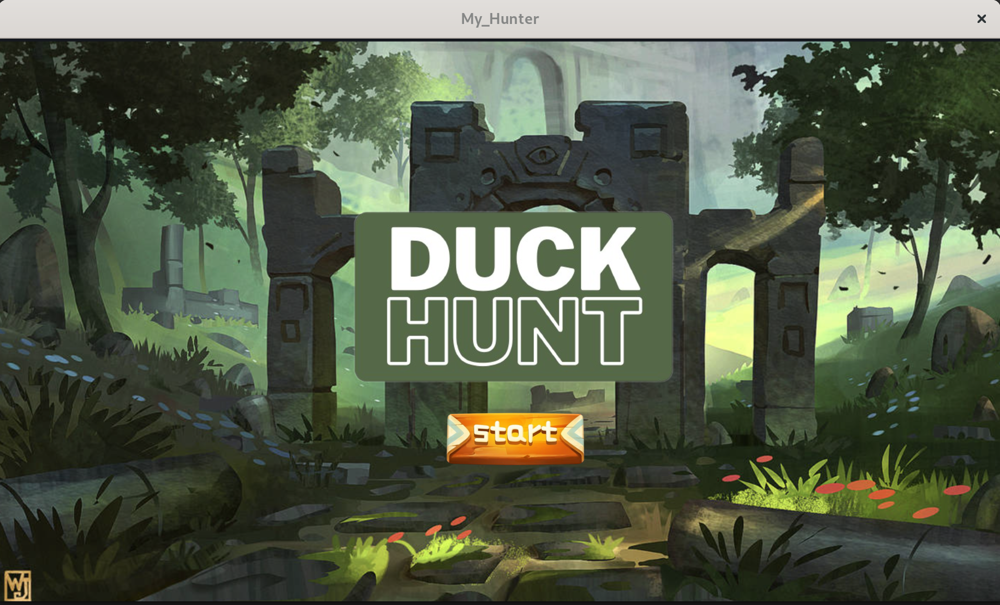
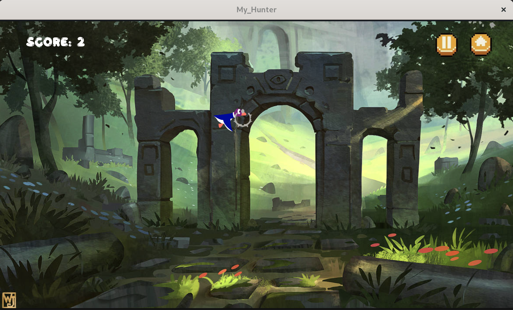

# Mini-Duck-Hunt {EPITECH project}
This project if one of the first projects done during the first year at Epitech.

This small video game is based on the rules of Duck Hunt and was made for a school project.

  The basic rules for the my_hunter are as follows: 
  
    • the player is a hunter who shoots ducks.
    
    • ducks appear on the screen and move from one side to another.
    
    • the player can click on them to shoot them.
    

# Before cloning repository
Having the csfml library installed is needed: https://www.sfml-dev.org/download/csfml/

# How to run the game
```
$ ./my_hunter
OR
$ ./my_hunter -h
```

# Preview
1. Starting screen


2. Gameplay


3. Starting screen


# Requierements
## MUST:

[x] • The window must be closed using events.

[x] • The program must manage the input from the mouse click.

[x] • The program must contain animated sprites rendered thanks to sprite sheets.

[x] • The program must contain moving (rotating, translating, or scaling) elements.

[x] • The program must accept the “-h” option, then display a short description of the program, and the available user inputs.


## SHOULD
[x] • Animations and movements in your program should not depend on the speed of your computer.

[x] • Animations and movements in your program should be timed by sfClock elements.

[] • Your window should stick between 800x600 pixels and 1920x1080 pixels.

[x] • Your window should have a limited frame rate such that it can be compute without lagging.


## COULD
[] • The program could have several different levels.

[x] • The program could have an increasing difficulty.

[x] • The program could display the score of the player.

[] • The program could store the highest score made.

[x] • The program could display a small target under the mouse cursor.

